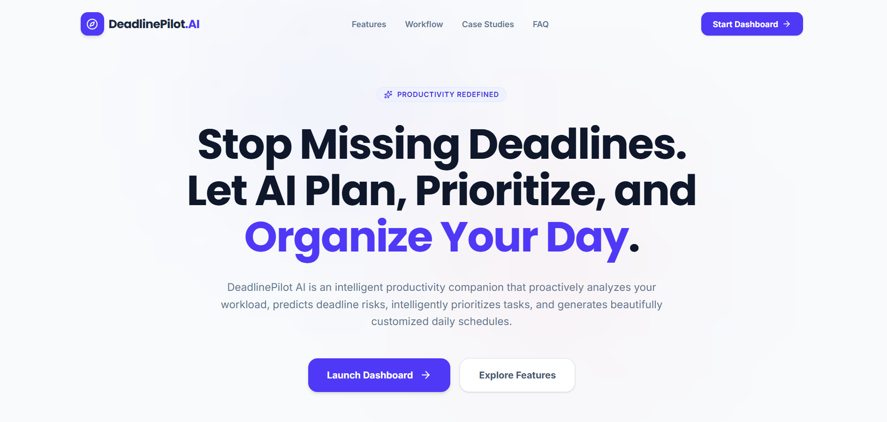
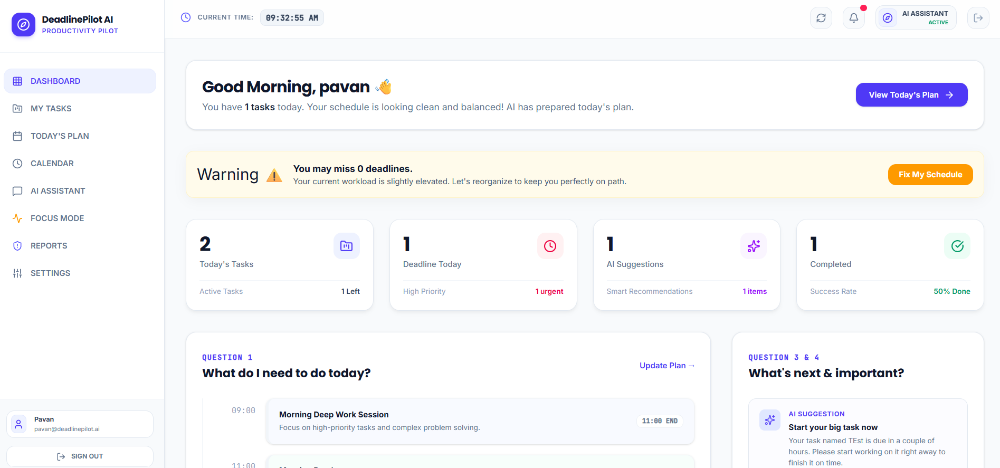
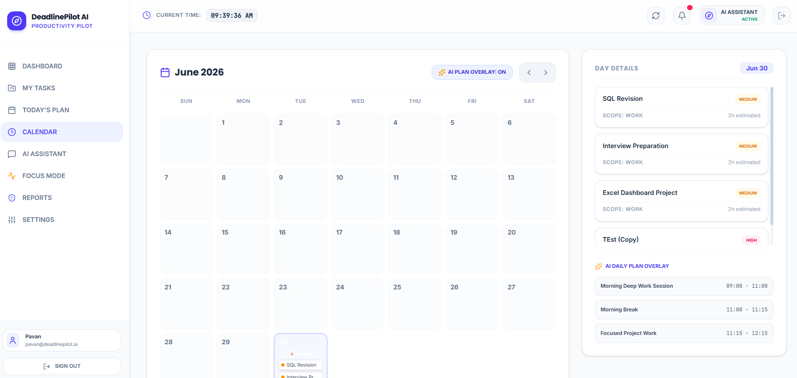
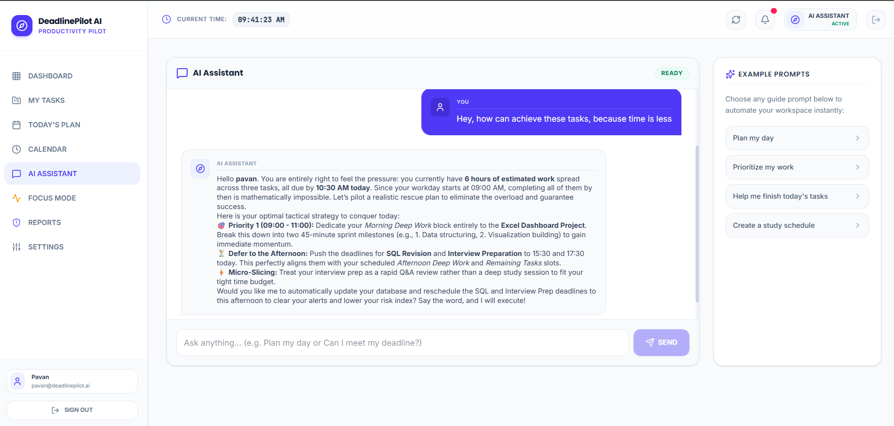
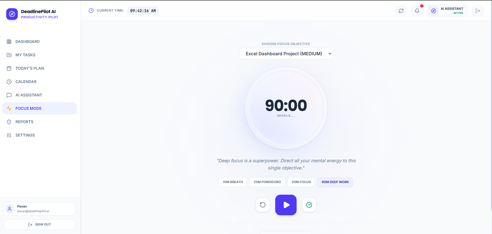
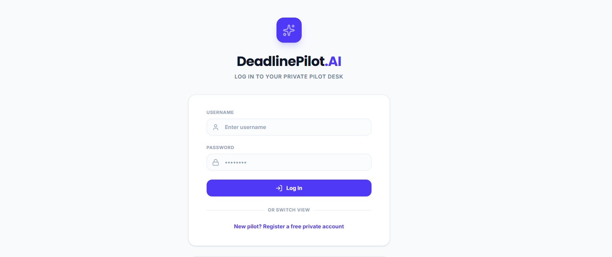

<div align="center">

# ⏱️ DeadlinePilot AI

### Your AI Productivity Companion that helps you plan smarter, prioritize better, and complete tasks before deadlines are missed.

[](https://react.dev/)
[](https://nodejs.org/)
[](https://www.sqlite.org/)
[](https://ai.google.dev/)
[](https://cloud.google.com/run)
[](#-license)

**[🚀 Live Demo](https://deadlinepilot-ai-1084878236883.us-west1.run.app/)** · **[📂 Repository](https://github.com/data-pavan/DeadlinePilot-AI---Hackathon-Project)**

</div>

---

## 🌐 Live Demo

🔗 **[https://deadlinepilot-ai-1084878236883.us-west1.run.app/](https://deadlinepilot-ai-1084878236883.us-west1.run.app/)**

---

## 🧩 Problem Statement — *"The Last-Minute Life Saver"*

We've all been there — deadlines creeping up while tasks remain half-planned and priorities stay unclear. Traditional to-do apps simply list tasks; they don't think for you when you're overwhelmed.

Students, professionals, and freelancers often juggle multiple deadlines at once with no clear sense of what to tackle first. The result is last-minute panic, rushed work, and missed submissions.

What's missing isn't another reminder app — it's a system that actually understands urgency, breaks down complex work, and tells you *what to do right now*.

**DeadlinePilot AI** was built for exactly this moment — the night before a deadline, the morning of a crunch, the week everything piles up — acting as the last-minute life saver people actually need.

---

## 💡 Solution

**DeadlinePilot AI** is more than a reminder app — it's an intelligent productivity partner.

Instead of just notifying you about due dates, it **proactively analyzes your workload**, prioritizes tasks based on urgency and effort, generates a realistic daily plan, and breaks large tasks into manageable steps — helping you actually finish work before time runs out.

---

## ✨ Features

| Feature | Description |
|---|---|
| 🧠 **AI Task Prioritization** | Automatically ranks tasks by urgency, deadline, and effort using Gemini AI. |
| 📅 **AI Daily Planner** | Generates a smart, realistic daily schedule based on your pending workload. |
| 🚨 **Deadline Rescue Plan** | Creates an emergency action plan when deadlines are dangerously close. |
| 🧱 **Task Breakdown** | Splits large, complex tasks into smaller actionable sub-tasks. |
| 🤖 **AI Assistant** | A conversational assistant to help plan, clarify, and organize your work. |
| 📊 **Dashboard** | Visual overview of progress, pending tasks, and productivity insights. |
| 🗓️ **Calendar** | Unified calendar view of all deadlines and scheduled tasks. |
| 🎯 **Focus Mode** | A distraction-free mode to help you concentrate on one task at a time. |
| 🔐 **Secure User Authentication** | Safe and reliable login system to protect user data. |

---

## 🛠️ Tech Stack

**Frontend**
- React
- Vite
- Tailwind CSS
- React Router
- Framer Motion

**Backend**
- Node.js
- Express.js

**Database**
- SQLite

**AI**
- Google Gemini API

**Charts**
- Recharts

**Deployment**
- Google Cloud Run

---

## ☁️ Google Technologies Used

| Technology | Usage |
|---|---|
| **Google AI Studio** | Used to design, test, and refine prompts for the Gemini-powered features. |
| **Gemini API** | Powers AI task prioritization, daily planning, task breakdown, and the AI assistant. |
| **Google Cloud Run** | Hosts and serves the deployed application with scalable, serverless infrastructure. |

---

## 🏗️ Architecture

```
                User
                  ↓
          React Frontend
                  ↓
         Express Backend
                  ↓
         SQLite Database
                  ↓
            Gemini API
```

---

## 📁 Project Structure

```
DeadlinePilot-AI/
├── client/                 # React frontend
│   ├── src/
│   │   ├── components/
│   │   ├── pages/
│   │   ├── hooks/
│   │   └── App.jsx
│   └── package.json
├── server/                 # Node.js + Express backend
│   ├── routes/
│   ├── controllers/
│   ├── models/
│   ├── db/
│   └── index.js
├── .env.example
├── package.json
└── README.md
```

---

## ⚙️ Installation

**1. Clone the repository**
```bash
git clone https://github.com/data-pavan/DeadlinePilot-AI---Hackathon-Project.git
```

**2. Install dependencies**
```bash
npm install
```

**3. Run the development server**
```bash
npm run dev
```

---

## 🔑 Environment Variables

Create a `.env` file in the root directory:

```env
GEMINI_API_KEY=your_gemini_api_key_here
DATABASE_URL=your_database_url_here
```

---

## 📸 Screenshots

| Page | Preview |
|---|---|
| 🏠 Landing Page |  |
| 📊 Dashboard |  |
| 🧠 AI Planner |  |
| 🗓️ Calendar |  |
| 🤖 AI Assistant |  |
| 🎯 Focus Mode |  |
| 🔐 Login Page |  |

---

## 🚀 Future Scope

- 📆 Google Calendar Integration
- 🎙️ Voice Assistant
- 📱 Mobile App
- 🔔 Smart Notifications
- 📈 Habit Tracking
- 👥 Team Collaboration

---

## 🙏 Open Source Credits

Huge thanks to the amazing open-source projects that made DeadlinePilot AI possible:

- [React](https://react.dev/)
- [Tailwind CSS](https://tailwindcss.com/)
- [Express](https://expressjs.com/)
- [SQLite](https://www.sqlite.org/)
- [React Router](https://reactrouter.com/)
- [Framer Motion](https://www.framer.com/motion/)
- [Lucide React](https://lucide.dev/)
- [Recharts](https://recharts.org/)

---

## 📄 License

This project is licensed under the **MIT License**.

---

## 👤 Author

**Pavana R**
🔗 GitHub: [@data-pavan](https://github.com/data-pavan)

---

<div align="center">

⭐ **If you found this project interesting, consider giving it a Star.**

</div>
